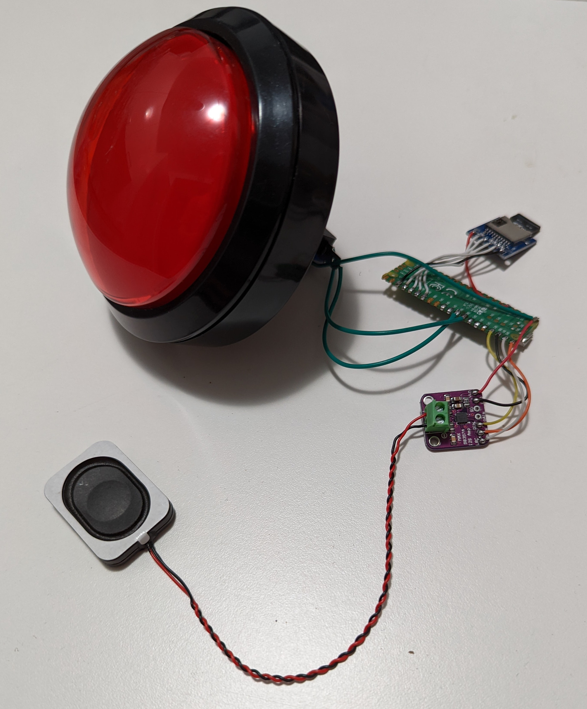

# Restroom Privacy Mode
Mute your bodily sounds by playing random music.

A fun little project that I made in under a day.

---

### Hardware
* Raspberry Pi Pico
* MAX98357 DAC + Amp (any I2S DAC should work)
* 3W Speaker
* SD Card Board
* SD Card
* 5V Power Supply
* BIG RED BUTTON!

---

### Setup Process and Assembly Instructions

#### Software Setup

1. Flash the Raspberry Pi Pico with `CircuitPython` using the `.uf2` file from
[here](https://circuitpython.org/board/raspberry_pi_pico/)

2. Simply drag the `.uf2` file onto the mass storage device while your Pico is in
the bootloader. You can enter the bootloader by holding the `BOOTSEL` button.

3. A `CIRCUITPY` storage device should appear on your computer. Drag the `code.py` file from this repository
onto it, and you should be good to go!

#### Hardware setup

##### DAC

`RPi Pico` -- `MAX98357`

`VBUS` -- `Vin`

`GND` -- `GND`

`GP0` -- `BCLK`

`GP1` -- `LRC`

`GP2` -- `DIN`

##### SD Card

`RPi Pico` -- `SD Card`

`3.3V` -- `3.3V`

`GP10` -- `CLK`

`GP11` -- `MOSI`

`GP12` -- `MISO`

`GP13` -- `CS`

`GND` -- `GND`

##### BIG RED BUTTON

`RPi Pico` -- `BIG RED BUTTON`

`GND` -- `COM`

`GP6` -- `NO`

`VBUS` -- `LED`

---

### Usage instructions
Press the button to play a randomly selected track from the SD card.

Hold the button to stop playback.

It is that simple!

---

### Extra suggestions
You can wire the power directly to the light fixture in your restroom.
